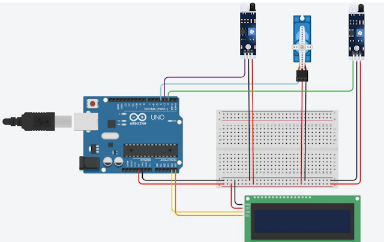

<h2>Système de parking automatisé avec barrière utilisant Arduino Uno 🚗🚧</h2>

| Auteur              | Information         |
|---------------------|---------------------|
| Sora Dragoș-Emil | [GitHub Profile](https://github.com/sora-dragos-emil) |

## Description

Ce projet présente un système intelligent de parking avec barrière automatisée, contrôlé par Arduino Uno.
Le système détecte l'arrivée des véhicules grâce à des capteurs IR, actionne une barrière via un servo-moteur pour contrôler l'accès, et affiche des informations pertinentes sur un écran LCD, comme le nombre de places disponibles ou des messages d'instruction pour les utilisateurs.

## Pourquoi ce projet?

Les systèmes de gestion de parking automatisés représentent une solution pratique à plusieurs problèmes urbains actuels:

1)<b>Optimisation de l'espace:</b> En contrôlant précisément les entrées et sorties, ce système permet une utilisation maximale des emplacements disponibles.

2)<b>Application pratique:</b> Ce prototype démontre des concepts fondamentaux d'électronique et de programmation dans un contexte d'usage quotidien, rendant l'apprentissage immédiatement applicable.

3)<b>Formation technologique complète:</b> Ce projet intègre des notions d'électronique, de programmation, de mécanique et d'interface utilisateur dans une seule réalisation.

## Architecture

Le système de parking automatisé opère selon trois mécanismes principaux:

1)<b>Système de détection</b>

a)<b>Capteurs IR:</b> Stratégiquement placés à l'entrée du parking, ces capteurs détectent l'arrivée ou le départ d'un véhicule et envoient un signal au microcontrôleur.

b)<b>Comptage des véhicules:</b> Le système maintient un décompte précis des places occupées et disponibles, assurant ainsi une gestion optimale de l'espace.

2)<b>Contrôle d'accès</b>

a)<b>Servo-moteur:</b> Actionnant une barrière physique, le servo-moteur régule l'accès au parking en fonction des informations reçues des capteurs et de la logique programmée.

b)<b>Logique décisionnelle:</b> L'Arduino analyse les données des capteurs en temps réel pour déterminer si la barrière doit s'ouvrir (places disponibles) ou rester fermée.

3)<b>Interface utilisateur</b>

a)<b>Écran LCD avec module I2C:</b> Fournit des informations essentielles comme le nombre de places disponibles, des instructions pour les conducteurs, ou des messages de bienvenue.

b)<b>Indicateurs visuels:</b> Des signaux lumineux peuvent compléter l'affichage LCD pour indiquer rapidement si le parking est complet ou disponible.

## Schéma des composants du système

## Composants

| Nombre | Appareil        | Usage                        |  Prix(RON) 
|--------|-----------------|------------------------------|------------------------------------------------------------------------------------------------------------------|
|   1.   | Arduino UNO     | Microcontrôleur              | [39.37](https://www.optimusdigital.ro/en/avr-boards/2563-development-board-compatible-with-arduino-uno-atmega328p-i-ch340-with-50-cm-cable.html)                                                                                                                                               |
|   2.   | BreadBoard 400p | Montage des composants       | [4.56](https://www.optimusdigital.ro/en/breadboards/44-400p-hq-breadboard.html)                                  |
|   3.   | LCD & I2C Module| Afficher les messages        | [16.34](https://www.optimusdigital.ro/en/lcds/2894-1602-lcd-with-i2c-interface-and-blue-backlight.html)          |
|   4.   | 2 x IR Sensors  | Détecter les voitures        | [6.98](https://www.optimusdigital.ro/en/optical-sensors/4514-infrared-obstacle-sensor.html)                      |
|   5.   | Servo-motor SG90| Lever et abaisser la barrière| [13.99](https://www.optimusdigital.ro/en/servomotors/26-sg90-micro-servo-motor.html)                             |
|   6.   | Jumper Wires M-M| Connexions électriques       | [22.99](https://www.optimusdigital.ro/en/wires-with-connectors/12475-male-to-male-jumper-wires-40-pin-40cm.html) |

### Libraries

| Library | Description | Usage |
|---------|-------------|-------|
|  |  | |
| |  |  |

## Log

### Week 6 - 12 May

### Week 7 - 19 May

### Week 20 - 26 May

## Référence
[Youtube Tutorial](https://www.youtube.com/watch?v=P64CoHCSD6w&ab_channel=SimpleCircuits)
